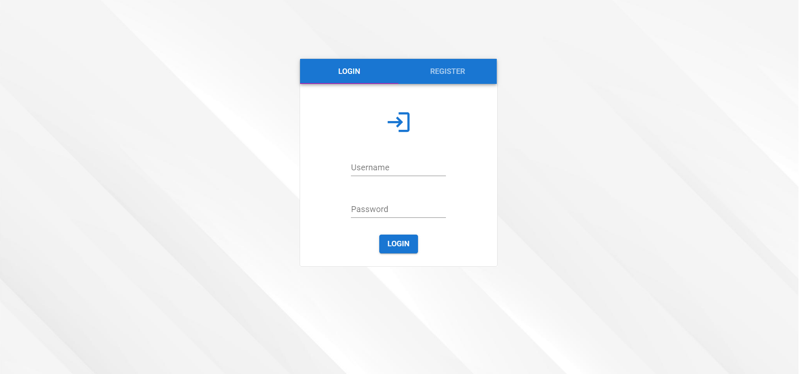
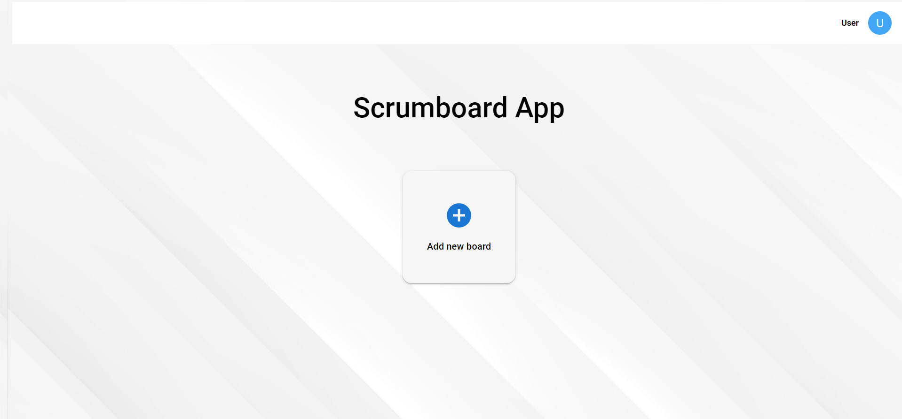
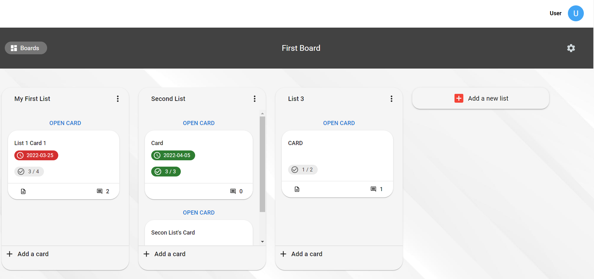
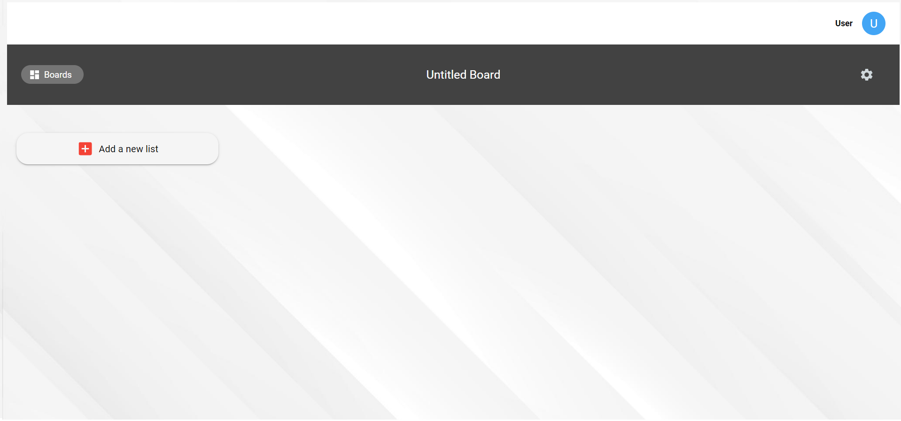
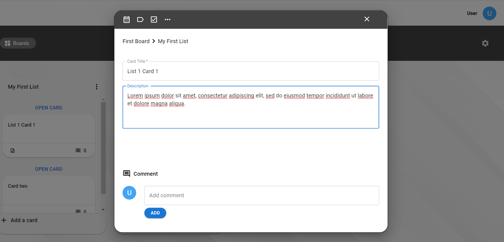
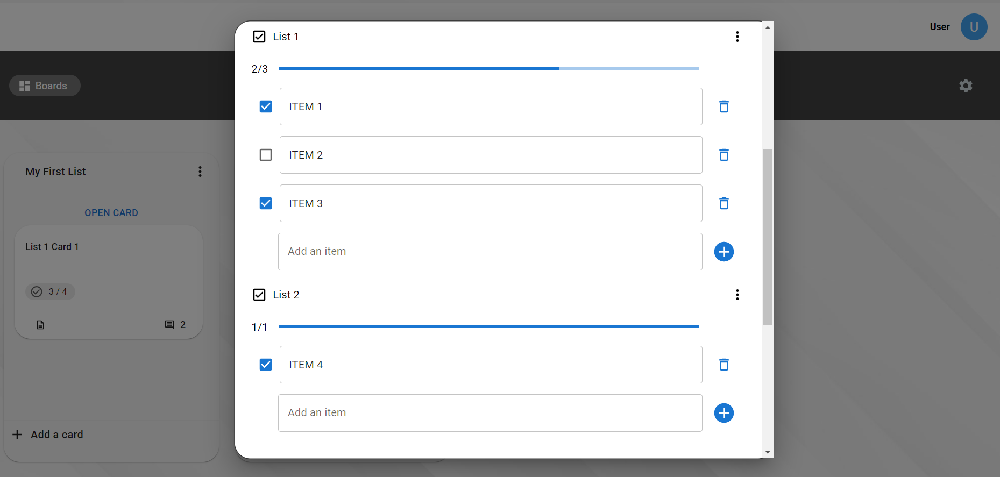
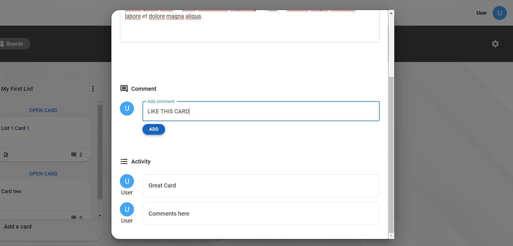
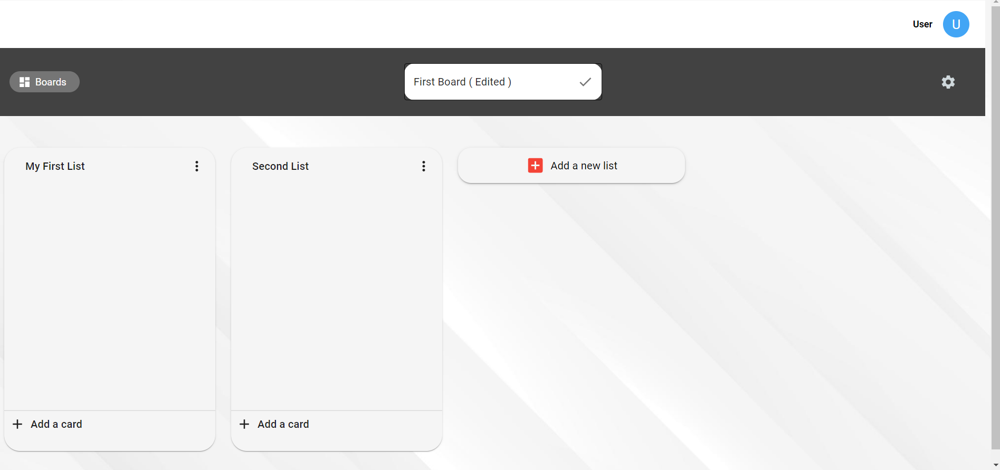
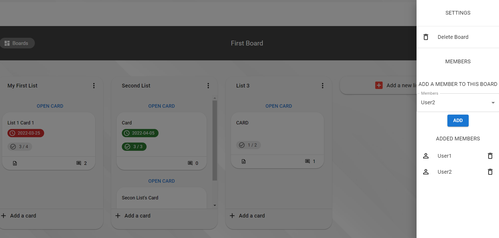

<p align="center">
 


</p>

It's kanban board app Patika & E-Çözüm React Bootcamp final project.

 

## Content

- [Introduction](#introduction)
- [Technologies Used](#technologies-used)
- [Installation](#installation)
- [Previews](#previews) 

<br>

# Introduction

- Kanban Project is an 
İkinci El Project is an E-Commerce app that allows users create, buy and sell products.

- If you already have an account you can sign-in. Else, you can register easily.
- You can create new board and share your board with users.
- You can create new lists in board and new cards.
- You can edit and delete your cards and lists. And You can also add some features like duedate,labels and checklists.
 

<br>

## Technologies Used

- ReactJS
- Redux
- Redux-Thunk
- React Cookie
- Axios
- Mui

<br>

## Installation

- First, clone the project:

```sh
git clone https://github.com/yigitden/e-cozum-bootcamp-final-project.git
```

- Then, start the project on localhost:

```bash
# install dependencies with npm
npm install
# or install dependencies with yarn
yarn
# serve at localhost:3000
npm start
pmark
```

- To start unit testing:

```bash
# with npm
npm run test
# or with yarn
yarn run test
```

<br>
<br>

# Previews

<center>

## Login Page



## Home Page



## List Page


## Board Page




##  Card Page






